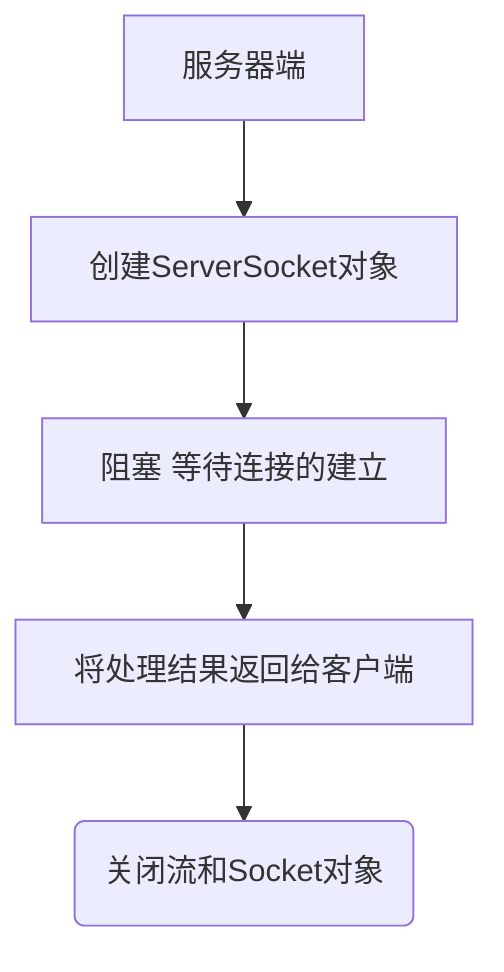
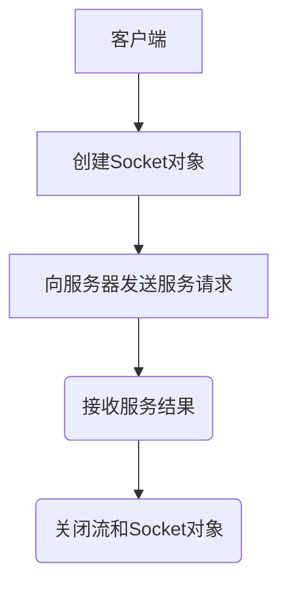

<font size = 4 face = "黑体">

TCP(Transfer Control Protocol)是面向连接的网络协议

TCP编程通讯原理，首先服务器创建ServerSocket，在指定端口监听并处理请求

客户端创建Socket,向服务器发送请求


#### ServerSocket

> java.net.ServerSocket


这个类实现了服务器套接字。服务器套接字等待来自网络的请求。它基于该请求执行某些操作，然后可能向请求者返回结果。 
服务器套接字的实际工作由SocketImpl类的一个实例进行。一个应用程序可以更改创建套接字实现的套接字工厂，以配置自己创建适合本地防火墙的套接字。


##### 构造方法
|Constructor | Description |
|:---|:---|
|  	ServerSocket()	| Creates an unbound server socket.
|  	ServerSocket(int port)	| Creates a server socket, bound to the specified port.
|  	ServerSocket(int port, int backlog)| Creates a server socket and binds it to the specified local port number, with the | specified backlog.
|  	ServerSocket(int port, int backlog, InetAddress bindAddr)	| Create a server with the specified port, listen backlog, and local IP address to | bind to.
| ServerSocket(SocketImpl impl)	^[protected	]| Creates a server socket with a user-specified SocketImpl.

##### 成员方法

|Method Modifier and Type	| 	Description|
|:---|:---|
| Socket	accept()	| Listens for a connection to be made to this socket and accepts it.
| void	bind(SocketAddress endpoint)	| Binds the ServerSocket to a specific address (IP address and port number).
| void	bind(SocketAddress endpoint, int backlog)	| Binds the ServerSocket to a specific address (IP address and port number).
| void	close()	| Closes this socket.
| ServerSocketChannel	getChannel()	| Returns the unique ServerSocketChannel object associated with this socket, if any.
| InetAddress	getInetAddress()	| Returns the local address of this server socket.
| int	getLocalPort()	| Returns the port number on which this socket is listening.
| SocketAddress	getLocalSocketAddress()	| Returns the address of the endpoint this socket is bound to.
| <T> T	getOption(SocketOption<T> name)| Returns the value of a socket option.
| int	getReceiveBufferSize()	| Gets the value of the SO_RCVBUF option for this ServerSocket, that is the proposed buffer size that will be used for Sockets accepted from this ServerSocket.
| boolean	getReuseAddress()	| Tests if SO_REUSEADDR is enabled.
| int	getSoTimeout()	| Retrieve setting for SO_TIMEOUT. 0 returns implies that the option is disabled (i.e., timeout of infinity).
| protected void	implAccept(Socket s)	| Subclasses of ServerSocket use this method to override accept() to return their own subclass of socket.
| boolean	isBound()	| Returns the binding state of the ServerSocket.
| boolean	isClosed()	| Returns the closed state of the ServerSocket.
| <T> ServerSocket	setOption(SocketOption<T> name, T value)	| Sets the value of a socket option.
| void	setPerformancePreferences(int connectionTime, int latency, int bandwidth)	| Sets performance preferences for this ServerSocket.
| void	setReceiveBufferSize(int size)	| Sets a default proposed value for the SO_RCVBUF option for sockets accepted from this ServerSocket.
| void	setReuseAddress(boolean on)	| Enable/disable the SO_REUSEADDR socket option.
| static void	setSocketFactory(SocketImplFactory fac)	| Sets the server socket implementation factory for the application.
| void	setSoTimeout(int timeout)	| Enable/disable SO_TIMEOUT with the specified timeout, in milliseconds.
| Set<SocketOption<?>>	supportedOptions()	| Returns a set of the socket options supported by this server socket.
| String	toString()	| Returns the implementation address and implementation port of this socket as a String.


#### Socket


这个类实现了客户端套接字（也被称为“套接字”）。套接字是两台机器之间的通信的一个端点。 
套接字的实际工作是由该类的一个实例进行SocketImpl。一个应用程序，通过改变创建套接字实现的套接字工厂，可以配置自己创建适合本地防火墙的套接字。


##### 构造方法
|Constructor | Description |
|:---|:---|
|   Socket() | 创建一个连接的套接字，与socketimpl系统默认的类型。  
|   Socket(InetAddress address, int port) | 创建一个流套接字，并将其与指定的IP地址中的指定端口号连接起来。  
|   Socket(InetAddress host, int port, boolean stream) | 过时的。  
| 使用UDP传输DatagramSocket。  
|   Socket(InetAddress address, int port, InetAddress localAddr, int localPort) | 创建一个套接字，并将其与指定的远程端口上的指定的远程地址连接起来。  
|   Socket(Proxy proxy) | 创建一个连接的套接字类型，指定代理，如果有，应该使用无论任何其他设置。  
| Socket(SocketImpl impl) ^[protected  ]| 创建一个用户指定的socketimpl连接插座。  
|   Socket(String host, int port) | 创建一个流套接字，并将其与指定的主机上的指定端口号连接起来。  
|   Socket(String host, int port, boolean stream) | 过时的。  
| 使用UDP传输DatagramSocket。  
|   Socket(String host, int port, InetAddress localAddr, int localPort) | 创建一个套接字，并将其连接到指定的远程端口上的指定的远程主机上。  


##### 成员方法

|Method Modifier and Type	| 	Description|
|:---|:---|
| void bind(SocketAddress bindpoint) | 将套接字绑定到本地地址。  
| void close() | 关闭这个套接字。  
| void connect(SocketAddress endpoint) | 将此套接字连接到服务器。  
| void connect(SocketAddress endpoint, int timeout) | 将此套接字与指定的超时值连接到服务器。  
| SocketChannel getChannel() | 返回与此套接字关联的独特的 SocketChannel对象，如果任何。  
| InetAddress getInetAddress() | 返回套接字连接的地址。  
| InputStream getInputStream() | 返回此套接字的输入流。  
| boolean getKeepAlive() | 如果 SO_KEEPALIVE启用。  
| InetAddress getLocalAddress() | 获取绑定的套接字的本地地址。  
| int getLocalPort() | 返回此套接字绑定的本地端口号。  
| SocketAddress getLocalSocketAddress() | 返回此套接字绑定到的端点的地址。  
| boolean getOOBInline() | 如果 SO_OOBINLINE启用。  
| OutputStream getOutputStream() | 返回此套接字的输出流。  
| int getPort() | 返回此套接字连接的远程端口号。  
| int getReceiveBufferSize() | 得到这个 Socket的 SO_RCVBUF选项的值，是由平台用于该 Socket输入缓冲区的大小。  
| SocketAddress getRemoteSocketAddress() | 返回此套接字连接的端点的地址，或如果它是无关的 null。  
| boolean getReuseAddress() | 如果 SO_REUSEADDR启用。  
| int getSendBufferSize() | 得到这个 Socket的 SO_SNDBUF期权价值，即缓冲区的大小由平台用于输出在这 Socket。  
| int getSoLinger() | 返回设置 SO_LINGER。  
| int getSoTimeout() | 返回设置 SO_TIMEOUT。  
| boolean getTcpNoDelay() | 如果 TCP_NODELAY启用。  
| int getTrafficClass() | 获取从这个套接字发送的数据包的IP头中的业务类或服务类型  
| boolean isBound() | 返回套接字的绑定状态。  
| boolean isClosed() | 返回套接字的关闭状态。  
| boolean isConnected() | 返回套接字的连接状态。  
| boolean isInputShutdown() | 返回套接字连接的读半是否关闭。  
| boolean isOutputShutdown() | 返回套接字连接的写是否关闭的是否关闭。  
| void sendUrgentData(int data) | 在套接字上发送一个字节的紧急数据。  
| void setKeepAlive(boolean on) | 启用/禁用 SO_KEEPALIVE。  
| void setOOBInline(boolean on) | 启用/禁用 SO_OOBINLINE（TCP紧急数据收据）默认情况下，此选项是禁用TCP套接字上接收紧急数据是默默丢弃。  
| void setPerformancePreferences(int connectionTime, int latency, int bandwidth) 
| 设置此套接字的性能首选项。  
| void setReceiveBufferSize(int size) | 集 SO_RCVBUF选项，这 Socket指定值。  
| void setReuseAddress(boolean on) | 启用/禁用 SO_REUSEADDR套接字选项。  
| void setSendBufferSize(int size) | 设置这个 Socket指定值的 SO_SNDBUF选项。  
| static void setSocketImplFactory(SocketImplFactory fac) 
| 设置客户端套接字实现工厂的应用程序。  
| void setSoLinger(boolean on, int linger) | 启用/禁用 SO_LINGER与指定的逗留的时间秒。  
| void setSoTimeout(int timeout) | 启用/禁用 SO_TIMEOUT以指定的超时时间，以毫秒为单位。  
| void setTcpNoDelay(boolean on) | 启用/禁用 TCP_NODELAY（禁用/启用Nagle的算法）。  
| void setTrafficClass(int tc) | 集交通类或从该套接字发送数据包的IP报头字节型服务。  
| void shutdownInput() | 将此套接字的输入流放在“流结束”中。  
| void shutdownOutput() | 禁用此套接字的输出流。  
| String toString() | 将这一 String插座。  


 :| 服务器和客户端的创建步骤





#### 创建服务和客户端

##### 客户端

```java
import java.io.DataOutputStream;
import java.io.IOException;
import java.net.Socket;
import java.net.UnknownHostException;

/*
 * 创建客户端
 * 1.建立连接：使用Socket创建客户端+服务器的地址和端口
 * 2.操作
 * 3.释放资源
 */
public class client {
	public static void main(String[] args) throws UnknownHostException, IOException {
		// 1.建立连接：使用Socket创建客户端+服务器的地址和端口
		Socket client = new Socket("localhost", 9999);
		//2.操作
		DataOutputStream dos = new DataOutputStream(client.getOutputStream());
		String data = "hello";
		dos.writeUTF(data);
		dos.flush();
		//3.释放资源
		dos.close();
		client.close();
	}
}

```


##### 服务端

```java
import java.io.DataInputStream;
import java.io.IOException;
import java.net.ServerSocket;
import java.net.Socket;

/*
 * 1.指定端口，使用ServerSocket创建服务器
 * 2.阻塞、等待连接的建立
 * 3.操作
 * 4.关闭流和Socket对象
 */
public class server {
	public static void main(String[] args) throws IOException {
		//1.指定端口，使用ServerSocket创建服务器
		ServerSocket server = new ServerSocket(9999);  
		//2.阻塞、等待连接的建立
		Socket sc = server.accept();
		//3.操作
		DataInputStream dis = new DataInputStream(sc.getInputStream());
		String data = dis.readUTF();
		System.out.println(data);
		//4.关闭流和Socket对象
		dis.close();
		sc.close();
		server.close();
	}
}
```


</font>